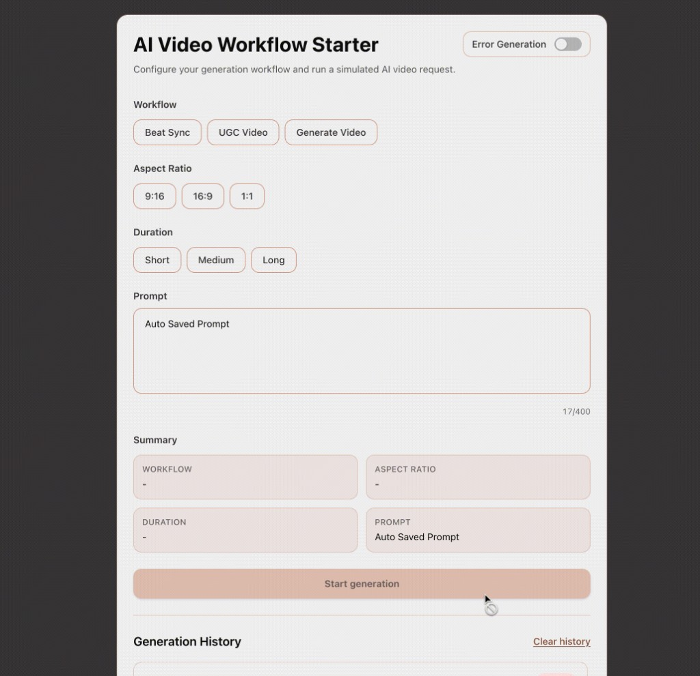

# AI Video Workflow Starter

Test assignment project built with Vue 3, TypeScript, Vite, and TailwindCSS.

## Preview



## Requirements

- Node.js 18+ (recommended: latest LTS)
- npm 9+

## Run Locally

1. Install dependencies:

```bash
npm install
```

2. Start development server:

```bash
npm run dev
```

3. Open the URL from terminal output (usually [http://localhost:5173](http://localhost:5173)).

## Build for Production

```bash
npm run build
```

## Preview Production Build

```bash
npm run preview
```

## Main Features

- AI workflow form (workflow, aspect ratio, duration, prompt)
- Prompt validation with max length and live counter
- Optional forced error mode for testing
- Generation history with localStorage persistence
- Last prompt auto-restore after page reload
